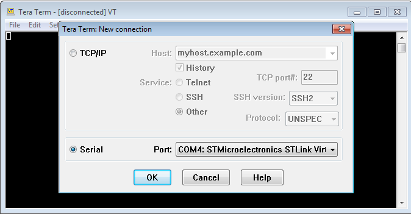
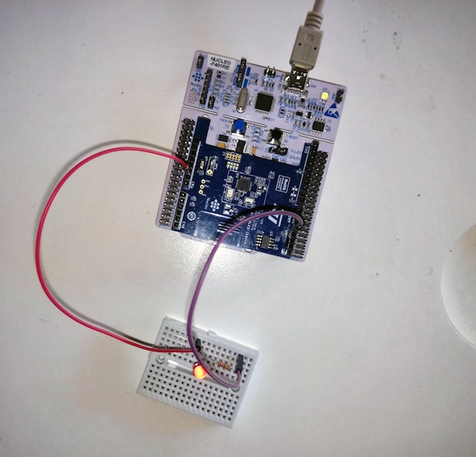
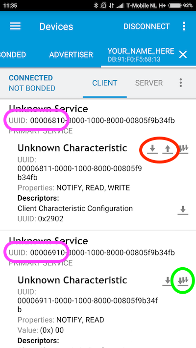

# Ada Lovelace Hackathon - Building Bluetooth devices - Instructions

Welcome to our session at the Ada Lovelace Hackathon! If you have any questions, please just give a shout. We are here to help.

In this session we'll be building seven examples together, introducing you to:

* Building Bluetooth devices with ARM mbed.
* Building an accompanying app with Evothings.
* Storing data in Firebase and visualizing your data.

We will demonstrate everything on stage, but in case you're stuck this document will help you get back on track. We've also listed some additional excercises if you want a challenge.

> If you happen to be much faster than everyone else, help your neighbors.

## Prerequisites

We need to install a few pieces of software that we'll be using.

On your computer:

1. On your computer, install [Evothings Studio](https://evothings.com).
    * When you start Evothings Studio it will ask for a 'Cloud token', you can get one on the downloads page.
1. Download the source code for this workshop from [here](https://github.com/ARMmbed/workshop-ada-lovelace-ble) - and unpack in a convenient location.
1. If we are using the simulator: [node.js](https://nodejs.org).

If you are on Windows, also install:

1. [ST Link](http://janjongboom.com/downloads/st-link.zip) - serial driver for the board.
    * Run `dpinst_amd64` on 64-bits Windows, `dpinst_x86` on 32-bits Windows.
    * Afterwards, unplug your board and plug it back in.
    * (Not sure if it configured correctly? Look in 'Device Manager > Ports (COM & LPT)', should list as STLink Virtual COM Port.
1. [Tera term](https://osdn.net/projects/ttssh2/downloads/66361/teraterm-4.92.exe/) - to see debug messages from the board.

On your Android or iOS device:

1. Install [Evothings Viewer](https://evothings.com/doc/studio/evothings-viewer.html) - to view the application we'll build.
1. Install [nRF Connect](https://www.nordicsemi.com/eng/Products/Nordic-mobile-Apps/nRF-Connect-for-mobile-previously-called-nRF-Master-Control-Panel) - to debug the connection between your development board and your phone.

## Setup

1. Attach the BLE Shield to your development board.
1. Connect the NUCLEO_F401RE board to your computer.
1. The board mounts as a mass-storage device (like a USB drive). Verify that you can see it (the drive name will be NUCLEO).
1. Go to [http://developer.mbed.org](http://developer.mbed.org).
1. Create an ARM mbed account if you do not have one.
1. On the top right corner, click the Compiler button.
1. An IDE should open. Congratulations!

**Local development:** If you like things locally, you can do so by using [mbed CLI](https://docs.mbed.com/docs/mbed-os-handbook/en/5.1/getting_started/blinky_cli/#installing-mbed-cli-and-a-toolchain). I very much recommend to just use the online IDE, as it makes it easier for us, but if you want to continue hacking in the future, this is a nice way.

## Updating the firmware on the board

Download [stsw-link-007.zip](http://janjongboom.com/downloads/
stsw-link007.zip), and open 'AllPlatforms\STLinkUpgrade.jar'. Click 'Open in update mode' and then click 'Update'.

> If the file is not clickable, but you do have Java installed, run `java -jar STLinkUpgrade.jar` from the command line...

Or ask Jan to do it for you :-).

## 1. Blinky

1. First we need to set up our project and our target. Go to the [NUCLEO_F401RE platform page](https://developer.mbed.org/platforms/ST-Nucleo-F401RE/) and click the **Add to your mbed Compiler** button.
1. Go back to the compiler browser window and refresh the page.
1. Click the Import button, then click **Click Here to import from URL**.
1. Paste the following URL: https://github.com/ARMmbed/workshop-ada-lovelace-ble.
1. Click the **Import** button.
1. In the top right corner, verify that the right development board is selected.

Next, we will select which program we will build. This step needs to be repeated every time we progress to the next example.

1. In the tree, locate 'select_project.h'.
1. Change the number in this file to the project you want to build. In this case `1`.

Now we can implement the code to make the LED on your development board blink. Open ``1_blinky/main.h`` and under 'YOUR CODE HERE' add the following code:

```cpp
static void blinky() {
    // the LED is either on or off (a 1 or a 0). We can inverse the value with the `!` (inverse operator).
    // the flipped value is what we write back to the LED, thus toggling the LED.
    myled = !myled;
}
```

1. Now press Compile.
1. A file downloads.
1. Drag the file to the 'NUCLEO' disk.
1. The red LED on your board will flash.
1. Blinky runs!

**Optional:** We use [Ticker](https://developer.mbed.org/handbook/Ticker) to periodically run the blinky function. You could also use [Timeout](https://developer.mbed.org/handbook/Timeout) to run a function after a specified delay. Rewrite the code so that it uses the Timeout class. Afterwards see if you can vary the time between blinks ([hint](http://www.cplusplus.com/reference/cstdlib/rand/)).

### Showing debug messages

To show debug messages we need a serial monitor. Follow the instructions below. Your output should be:

```
blink! led is now 0
blink! led is now 1
blink! led is now 0
```

#### Windows

To see debug messages, install:

1. [ST Link](http://janjongboom.com/downloads/st-link.zip) - serial driver for the board.
    * See above for more instructions.
1. [Tera term](https://osdn.net/projects/ttssh2/downloads/66361/teraterm-4.92.exe/) - to see debug messages from the board.

When you open Tera Term, select *Serial*, and then select the STLink COM Port.



#### OS/X

No need to install a driver. Open a terminal and run:

```
screen /dev/tty.usbm            # now press TAB to autocomplete and then ENTER
```

To exit, press: `CTRL+A` then `CTRL+\` then press `y`.

#### Linux

If it's not installed, install GNU screen (`sudo apt-get install screen`). Then open a terminal and find out the handler for your device:

```
$ ls /dev/ttyACM*
/dev/ttyACM0
```

Then connect to the board using screen:

```
sudo screen /dev/ttyACM0 9600                # might not need sudo if set up lsusb rules properly
```

To exit, press `CTRL+A` then type `:quit`.

## 2. Processing input

## 2a. Building a circuit

We currently control the built-in LED on the board. But we can also add new LEDs to the circuit using the breadboard. We need this to have more than one LED. Here is the pinout of the board for reference:


1. In ``1_blinky\main.cpp`` change `LED1` to `D4`.
1. Hook the circuit up:
    * Wire from pin D4 to your breadboard (B1).
    * Put a resistor on the breadboard (one end at B1).
    * On the other end of the resistor put the long leg of the LED.
    * On the short leg of the LED, put a wire to GND.
1. For a schematic overview, click [here](http://wiki.seeedstudio.com/images/thumb/d/d6/Arduino_Sidekick_1LED_Blink.jpg/400px-Arduino_Sidekick_1LED_Blink.jpg).
1. Compile the program, and verify that the LED on the breadboard is now controlled.



**Optional:** You can do the same thing for the button. Use pin D9, and wire up like [this](http://energia.nu/img/Button_bb.png) (use a 10K Ohm resistor). So left-top to GND, left-bottom 10K resistor to 3.3V, right-bottom wire to D9.

## 2b. Writing the code that responds to button presses

1. In 'select_project.h' change the number to `2`.
1. Open ``2_one_button/main.h``.
1. We want to execute a function when the button is pressed.
1. We already have code in place which responds when the buttons 'fall', which means the button is pressed.
1. Let's write a similar function as before, but now we fire whenever someone presses the button.
1. Under 'YOUR CODE HERE' add the following code:

```cpp
static void toggle_led() {
    led1 = !led1;
}
```

1. Press the **Compile** button and flash the application. Clicking on Button 1 will now toggle the LED. The built-in LED will blink when the application is alive... Does it crash? Hit the black button on the board.

**Optional 1:** We use `fall` currently, which triggers when the button is clicked. We can also use `rise` to get an event when the button is no longer clicked. Change the code so that the LEDs only burn when the button is pressed down.

**Optional 2:** When we start a periodic timer with a ticker, we can cancel the timer as well via:

```cpp
<name_of_ticker>.detach();
```

Use the above pattern in combination with 'Optional 1'. Start the blinking when a button is pressed, then stop the blinking when the button is pressed a second time.

## 3. Over Bluetooth Low Energy

1. In 'select_project.h' change the number to `2`.
1. Open ``3_over_ble/main.h``.
1. **Important:** First, on line 7, change the name of your device to a unique identifier (shorter than 15 characters).

Bluetooth Low Energy works via services and characteristics. A service is for example a drone, and a characteristic is the speed the drone is flying.

On your development board we will define two services:

* LED service, with one characteristic: on/off state
* Button service, with one characteristic: pressed/not-pressed

1. We can use the [SimpleBLE](https://developer.mbed.org/teams/mbed-x/code/SimpleBLE/) library to easily sync values between your development board and your phone.
1. For both characteristics we specify a new `SimpleChar` and pass in the Service UUID and the Characteristic UUID (you can pick whatever number you want for these, but we have chosen some already).
1. Under 'YOUR CODE HERE' add the following code:

```cpp
void updateLedOverBle(bool newValue) {  // a new value was written to the LED characteristic
    led1 = newValue;
}

// we create the LED state, which you can read & write, plus a callback method
SimpleChar<bool> ledState = ble.readWrite_bool(0x6810, 0x6811, &updateLedOverBle);
// button state is only readable
SimpleChar<bool> btnState = ble.readOnly_bool(0x6910, 0x6911);

// whenever button state changes, we update the button state
void btn_rise() {
    btnState = false;
}
void btn_fall() {
    btnState = true;
}
```

1. Press the **Compile** button and flash the application. LED1 should start blinking to indicate that the application is running.

### Using the simulator

This excercise can also be ran in a simulator, in case the BLE shields are not working. Here your computer will act as the Bluetooth Low Energy device. A lot less exciting, but at least we can do a workshop.

To set up:

1. Install [node.js](https://nodejs.org).
1. Look at the [dependencies](https://github.com/sandeepmistry/bleno#prerequisites) for your operating system, and install them.
1. Open ``3_over_ble_simulator\main.js`` and change `MY_NAME` into a **unique** (short) name.
1. Open a terminal or command window and navigate to the folder where you extracted 'workshop-ada-lovelace-ble'.
1. Run `cd 3_over_ble_simulator`.
1. Run `npm install` - to install dependencies.
1. Run `node main.js`.
    * (might need to run as sudo on Linux).

You should see output similar to:

```
Button is not pressed, press 'p' to press
on -> stateChange: poweredOn
on -> advertisingStart: success
setServices: success
```

Your setup is now complete, and you can follow along again.

### Seeing your values in nRF Connect

We can verify that everything works in the nRF Connect app.

1. Open the app on your phone.
1. Scan for devices.
    * Tip: you can filter on RSSI if you have a lot devices in your vicinity.
1. If you see your device tap 'Connect'.
1. You'll go to the device page. From here you can inspect values of characteristics or write new values back to the device.



* In pink we see the service UUIDs (`6810` and `6910`).
* The buttons in red are to control the LED state (down is retrieve, up is update).
* The button in green can be used to subscribe to the button state.

**Note:** Do not see the right services after connecting? Tap the options menu and select 'Clear device cache' or 'Refresh services'.

We can use these buttons to control the device from our phone.

1. Click the green button. The value in the app will change (from 0-1) whenever you hold your finger on button 1.
1. Click the 'up' button (in the red circle).
1. In the first dropdown menu, select `BYTE`.
1. In the value textbox type `01`.
1. Click 'SEND'.
1. The LED on your breadboard turns on.
1. Send `00` to turn the LED off.

Congratulations, we have a connection with your device. We can now start writing an app.

**Optional:** Add a second characteristic under the button service which stores the number of times the button was pressed.

## 4. Building an app

1. You should have downloaded Evothings Studio on your computer. Launch it.
1. On first launch you'll need to generate a 'CLOUD TOKEN'. You can do this [here](https://evothings.com/download/).
1. Click 'CONNECT', and click 'GET KEY'.
1. On your phone, launch Evothings Viewer.
1. Type the same code as on your computer to connect computer and phone.
1. On your computer go to the 'My Apps' panel in Evothings Studio.
1. You downloaded eiab-bluetooth-le somewhere, open the folder, and drag `4_an_app` into Evothings 'My Apps' panel.
1. Click 'RUN'.
1. On your phone you should have a running app. Type the name of your device in and press 'Connect' to connect to your phone.
1. Nothing will work after connecting, we will write some code first.
1. Open `4_an_app/app.js` in your code editor of choice.

**Note:** When changing files in the app, the app on your phone will automatically reload. Often you'll need to reset your board when that happens, due to a bug in the Evothings BLE library. Press the black RESET button.

We can write code to read characteristics, subscribe to new values, or write characteristics.

Under 'YOUR CODE HERE' add the following:

```js
      // read the value of the button, and show it in the UI
      btnState.readValue().then(function(result) {
        var state = result.getUint8(0);
        updateButtonState(state);
      });

      // subscribe to notifications, and show it in the UI
      btnState.startNotifications();
      btnState.addEventListener('characteristicvaluechanged', function(e) {
        var state = e.target.value.getUint8(0);
        updateButtonState(state);
      });

      // writing to characteristics
      document.querySelector('#led-on').onclick = function() {
        var payload = new Uint8Array([ 1 ]);
        ledState.writeValue(payload);
      };
      document.querySelector('#led-off').onclick = function() {
        var payload = new Uint8Array([ 0 ]);
        ledState.writeValue(payload);
      };
```

Saving the file should automatically reload the app. Data from your device should now show up in the app through the wonders of Bluetooth.

**Note:** After reloading the app, click the RESET button on your development board.

**Tip:** The 'Console' view in Evothings Studio is very helpful to debug.

**Optional:** Add a new characteristic under the button service that stores the number of times the button was pressed. Also add a new field in the UI to show the value of this characteristic.

## 5. Adding sensors

Streaming button presses or controlling the LED are of course fun, but using a development board gives you plenty of other options as well, as we can add new sensors!

We brought three types of sensors, of which you can pick one:

* Temperature sensor - measure temperature around you.
* Ultrasonic distance sensor - measure how close someone is to your device.
* Light sensor - measure how light it is around you.

First, switch to the right project.

1. In 'select_project.h' change the number to `2`.
1. Open ``5_adding_sensors/main.h``.
1. **Important:** First, on line 7, change the name of your device to a unique identifier (shorter than 15 characters).

**Note:** If we are using the simulator, we can still see sensor values coming through on the development board. Comment line 30 (`ble.start(&eventQueue);`) out and look at the debug logs.

### Temperature sensor

1. Place the sensor on your breadboard.
1. The rounded side is the back of the sensor. **Don't get this wrong or you'll blow up the sensor!**
1. Seen from the front, connect:
1. Left pin to 5V.
1. Middle pin to A4.
1. Right pin to GND.

In `5_adding_sensors\main.cpp` under 'YOUR CODE HERE' add:

```cpp
// LM-35 is an analog temperatur sensor
AnalogIn temp(A4);

void readSensorState() {
    // Wait 5 seconds for the BLE stack to start
    wait_ms(5000);

    // This is in a separate thread, so we can just spin forever
    while (1) {
        // Do 10 readings to smooth the values out
        float total = 0.0f;
        for (uint8_t ix = 0; ix < 10; ix++) {
            total += temp.read();
            wait_ms(1);
        }

        // Divide total by 10 again
        float val = total / 10.0f;
        // The pin is 3.3V and the sensor is sending 0.1 mV per degree Celcius
        float temperature = (val * 3300.0f / 10.0f);

        printf("temperature is %.2fC\r\n", temperature);

        // And write back to the BLE characteristic
        mySensorState = static_cast<uint32_t>(temperature * 100.0f);

        // Wait 2 seconds before the next reading
        wait_ms(2000);
    }
}
```

### Ultrasonic distance sensor

1. Place the sensor on your breadboard.
1. Connect GND->GND.
1. Connect VCC on the ultrasonic sensor to 5V on the Nucleo board.
1. Connect Echo to D9.
1. Connect Trig to D10.

Now we can add a library which can read data from this sensor. In the online compiler:

1. Right click on your project.
1. Select 'Import Library' -> 'From import wizard'.
1. Type `HCSR04` (this is the name of the sensor).
1. Select the library by 'Antoniolinux B.'.
1. Double click to import.

In `5_adding_sensors\main.cpp` under 'YOUR CODE HERE' add:

```cpp
// initialize the sensor
#include "hcsr04.h"
HCSR04 ultrasonic(D10, D9);

// this will be running in a separate thread
void readSensorState() {
    // give the BLE stack 5 seconds to start up
    wait_ms(5000);

    // infinite loop
    while (1) {
        // read the value, print it and update the BLE variable
        long dist = ultrasonic.distance();
        printf("distance is %d\r\n", dist);
        mySensorState = dist;

        // then sleep for 2 seconds
        wait_ms(2000);
    }
}
```

Verify that you can see the values update in nRF Connect.

### Light sensor

1. Place the sensor on your breadboard.
1. Connect one end of the sensor to 5V.
1. Connect the other end of the sensor to pin `A5`.
1. From the same end as in 3. add a resistor (300-500 Ohm).
1. Connect the other end of the resistor to `GND`.
1. [Here's an image](https://openhomeautomation.net/wp-content/uploads/2013/03/photocell_bb-small.png).

In `5_adding_sensors\main.cpp` under 'YOUR CODE HERE' add:

```cpp
AnalogIn light(A5);

// this will be running in a separate thread
void readSensorState() {
    // give the BLE stack 5 seconds to start up
    wait_ms(5000);

    while (1) {
        // read the value, print it and update the BLE variable
        uint16_t val = light.read_u16();
        printf("value is %d\r\n", val);
        mySensorState = val;

        // then sleep for 2 seconds
        wait_ms(2000);
    }
}
```

Verify that you can see the values update in nRF Connect.

**Optional:** Don't limit yourself to just these sensors. Replace the built-in LED with a multicolor LED. Change the characteristic type to `u32` and encode color information in the characteristic. Allow the LED color to be controlled through Bluetooth.

## 5b. Using the simulator

Similar to what we did in 3, we can use the simulator on your computer if the BLE shield is not available. It will spit out fake temperature values which you can control using your keyboard (`u` and `d` keys).

1. Open ``5_adding_sensors_simulator\main.js`` and change `MY_NAME` into a **unique** (short) name.
1. Open a terminal or command window and navigate to the folder where you extracted 'workshop-ada-lovelace-ble'.
1. Run `cd 5_adding_sensors_simulator`.
1. Run `npm install` - to install dependencies.
1. Run `node main.js`.
    * (might need to run as sudo on Linux).

You should see output similar to:

```
Temperature is floating between 21 and 21.5 degrees. Press 'u' for up, 'd' for down.
on -> stateChange: poweredOn
on -> advertisingStart: success
setServices: success
```

Your setup is now complete, and you can follow along again.


## 6. Connecting to the cloud

We can now connect arbitrary sensors to your phone, but what if we want to see these values when you're not near your phone? Or if you want to share them through a dashboard?

We can use your phone (or actually, any old phone) as a 'gateway'. A device that will grab data over Bluetooth and stream it to a cloud provider where you can store that data. We'll now store this data in Firebase.

**Note:** If it says something like 'service not found', open ``6_to_the_cloud\app.js``, add a space or something and save, the app should re-load and it should work (bug in Evothings).

1. First, we need an account at Firebase.
1. Go to http://firebase.google.com
1. Click 'Get started'.
1. Click 'Create new project'.
1. Pick a name and click 'Create project'.
1. Click 'Add Firebase to your web project' and copy the snippet from the gray box to `6_to_the_cloud/index.html` under `FIREBASE CODE BELOW THIS LINE`.
1. Go to 'Auth' in the Firebase console.
1. 'Set up Sign in method'.
1. Click 'Anonymous' and 'Enable'.
1. Open Evothings Studio and drag `6_to_the_cloud` to 'YOUR APPS' panel.
2. Click 'RUN'.
3. Connect to your device. Data will now be sent to Firebase.
4. In the Firebase console go to the 'Database' tab and verify that data is sent over.

The relevant code is in `6_to_the_cloud/app.js`:

```js
// subscribe to notifications, and push it to firebase
sensorState.startNotifications();
sensorState.addEventListener('characteristicvaluechanged', function(e) {
  var state = e.target.value.getUint32(0);

  document.querySelector('#sensor-value').textContent = state;

  firebase.database().ref(name + '/value').push({
    ts: +new Date(),
    state: state
  });
});
```

**Tip:** Use the 'Database' panel in Firebase to remove old data in case you make a mistake.

**Optional:** We only stream data from one sensor into Firebase. Change the code so that you read multiple sensors and stream them into separate data streams.

## 7. Visualizing data

Now that we have data sent into Firebase, we can visualize your data live whenever the data comes in. We have quickly thrown together a web application which will plot your sensor values. You can find it under `7_dashboard`.

### JSFiddle

To see the web application without installing anything, go to https://jsfiddle.net/f7ktpLe2/.

Under 'FIREBASE CODE BELOW THIS LINE' paste your Firebase code from ``6_to_the_cloud`.

Then click 'Run'.

### Locally

1. Go to `7_dashboard` and run a local web server.
1. Tip: if you have Python installed, run `python -m SimpleHTTPServer`.

### Combining feeds

You can combine the data from many sensors if you share the same Firebase account. Pick one account and change your app (from `6_to_the_cloud`) to use their Firebase credentials.

Now see data from many sensors flow into the same charts!

**Optional:** We now *send* data to Firebase. However, we can also *retrieve* data... Look in `6_to_the_cloud` how to receive events, and use this to send data back to the device.

## 8. Play around

That was the formal part of this workshop! We hope that you have got a great introduction to building device software with ARM mbed, building apps with Evothings and storing data in the cloud.

We have other sensors with us that you can use to build some great prototypes:

* Buzzer - to play sounds - use [PwmOut](https://developer.mbed.org/handbook/PwmOut) to drive the buzzer.
* PIR-sensor - for motion sensing - use [InterruptIn](https://developer.mbed.org/handbook/InterruptIn) to detect when motion happens (connect to 5V, pinout is under the dome).
* Servo - to move things around - use [PwmOut](https://developer.mbed.org/handbook/PwmOut) to control the servo.
* Plus some random things like rain sensors...

Feel free to keep hacking, and come up with some great ideas!
